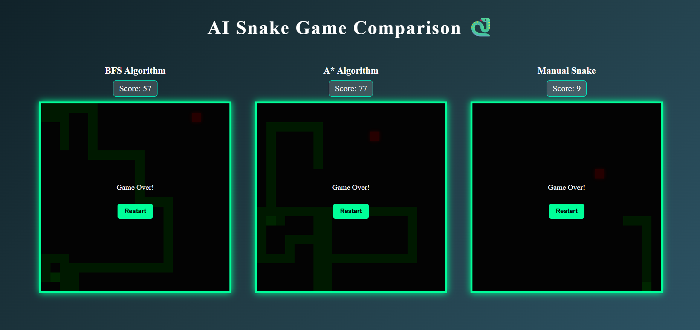

# 🐍 AI Snake Game Comparison

A real-time Snake Game comparison platform built using **React.js (Frontend)** and **Flask (Backend)**.

This project compares different pathfinding algorithms:

- 🎮 Manual Snake (Player Controlled)
- 🤖 BFS (Breadth First Search)
- 🤖 A* (A-Star Algorithm)

It analyzes performance based on:

- ✅ Score
- ⏱ Survival Time
- 🔄 Total Moves
- 🏆 Winner Detection

---

## 🚀 Features

- Manual Snake using keyboard arrow controls
- BFS-based AI Snake
- A*-based AI Snake
- Real-time algorithm comparison
- Clean UI with neon styling
- Independent score tracking per board
- Performance metrics display

---

## 🧠 Algorithms Used

### 1️⃣ Breadth First Search (BFS)
- Explores all possible moves level by level
- Guarantees shortest path to food
- May trap itself in complex situations

### 2️⃣ A* Algorithm
- Uses Manhattan Distance heuristic
- Smarter and more efficient than BFS
- Typically survives longer

### 3️⃣ Manual Mode
- Controlled using arrow keys
- Runs entirely on frontend (no backend required)

---

## 🏗 Project Structure
```
snake-ai/
│
├── frontend/
│ ├── src/
│ │ ├── components/
│ │ │ ├── Board.js
│ │ │ ├── Snake.js
│ │ │ ├── Food.js
│ │ │ ├── ScoreBoard.js
│ │ │ └── GameOver.js
│ │ ├── styles/
│ │ │ ├── board.css
│ │ │ └── app.css
│ │ └── App.js
│
├── backend/
│ ├── app.py
│ └── ai.py
│
└── README.md
```

---

## ⚙️ Installation & Setup

### 🔹 1. Clone the Repository

```bash
git clone https://github.com/ThamisettyPallavi47/SNAKE-GAME-COMPARISON
cd ai-snake-game

```
### 2.Backend Setup(Flask)
```bash
cd backend
pip install flask flask-cors
python app.py
```
### Backend will run at:
```bash
http://127.0.0.1:5000
```
### 3. Frontend Setup (React)
```bash
cd frontend
npm install
npm start
```
### Frontend runs at:
```bash

http://localhost:3000
```


## 🎮 Controls (Manual Mode)

| Key | Action |
|-----|--------|
| ⬆ Arrow Up | Move Up |
| ⬇ Arrow Down | Move Down |
| ⬅ Arrow Left | Move Left |
| ➡ Arrow Right | Move Right |

### 📊 Performance Comparison

After all games end, the system displays:

Algorithm Name

Final Score

## 💡 Why This Project?

### This project demonstrates:

React State Management

Real-time Game Loop

REST API Communication

Pathfinding Algorithms

AI Performance Analysis

Full Stack Development


### 🛠 Technologies Used

React.js

Flask

Python

BFS Algorithm

A* Algorithm

JavaScript (ES6)

CSS (Custom Neon Styling)

### 🏆 Sample Output



### 📈 Future Improvements

✅ Add Hybrid Smart AI (A* + Tail Safety Strategy)

✅ Add Speed Control Slider for dynamic difficulty

✅ Add Live Graph Comparison (Score vs Time visualization)

✅ Add Database for Score History & Performance Tracking

✅ Add Online Multiplayer Mode (Human vs Human)

✅ Display Final Winner Automatically

✅ Track Total Moves Used Per Algorithm

✅ Track Survival Time Per Algorithm

✅ Add Efficiency Metric (Score / Moves Ratio)

